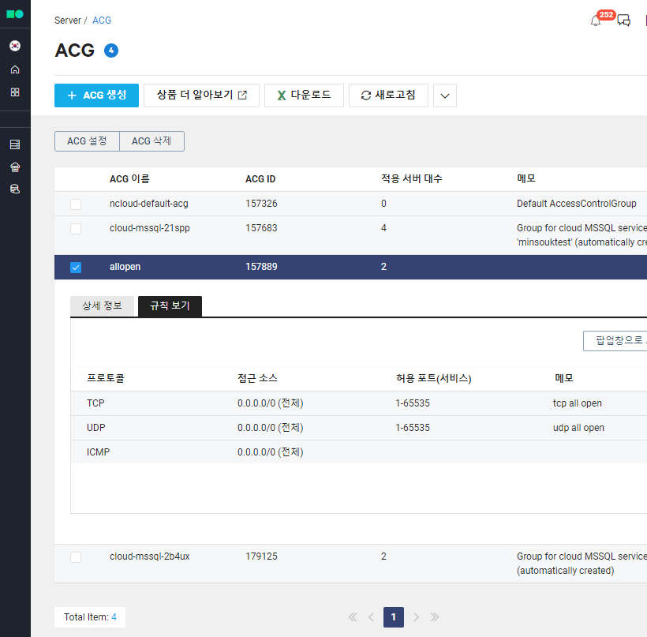

# Active Directory Tool 소개

Active Directory Tool(이하 AdTool) 은 Microsoft Active Directory를 네이버 클라우드 플랫폼이나 네이버 클라우드 플랫폼[공공기관용]에 쉽게 만들기 위해 제공되는 툴입니다. Active Directory는 SQL Server Always ON Availability Group을 구성하거나, Cloud Hadoop 인증 등을 구성하는데 사용될 수 있습니다. 사용자가 PowerShell 등 윈도우 명령어를 몰라도 해당 툴을 이용할 경우 20분 정도면 Active Directory 서버를 구축할 수 있습니다. 서버 구축을 위해 서버에 단 한 번의 로그인도 필요하지 않습니다. 해당 툴은 WPF (Windows Presentation Foundation)로 작성되어 있으며, 전체 소스는 공개되어 있습니다. (AdTool.zip 파일을 다운받아 바로 사용할 수 있습니다.)

## 주요 기능

**ncloud.com이나 gov-ncloud.com에서 Microsoft Active Directory 주 서버 설치, Active Directory 보조 서버 설치 자동화**

## 동작 개요

- AdTool의 기본적인 설정과 설정 검사 후, Create Server 메뉴에서 서버를 생성합니다. (AdTool에서 만든 서버만 AdTool로 제어할 수 있습니다.)
- AdTool 을 이용해 서버를 생성하면, Init Script 기능을 이용해 Agent(lazylog) 가 자동으로 설치합니다.
- AdTool 과 설치된 서버 Agent의 통신을 위해 Public Ip 와 Agent AccessKey, SecretKey를 할당 합니다. 통신은 암호화된 HTTPS WCF(Windows Communication Foundation) 통신을 합니다.
- Active Directory는 실제 운영 시, 안전한 운영을 위해 이중화 되어야 하므로 SetAdGroup 메뉴를 이용해 Group 을 생성합니다. 마스터 서버만 운영할 경우, Slave Server 콤보 박스에서 빈 서버를 선택합니다.
- AdTool 은 미리 정의된 템플릿에 Active Directory를 위한 PowerShell, Registry, Command Prompt 명령을 SetAdPrimary 메뉴에서 수행해 Active Directory 주 서버를 생성합니다.
- SetAdSecondary 메뉴를 이용해 Active Directory 보조 서버를 생성해 이중화 합니다. 
- 이후, ncloud.com 은 생성한 도메인\Administrator 계정과 Pem 파일을 이용해 확인한 암호로 도메인 계정으로 모든 서버에 접근 가능하며, gov-ncloud.com의 경우 도메인\ncloud 계정과 Pem 파일을 이용한 암호로 접근 가능합니다. 

## 동작

### 로그인

ncloud.com or gov-ncloud.com > 마이페이지 > 계정관리 > API 인증키 관리에서 API 인증키를 발급받아 AdTool에 로그인할 수 있습니다. Save 체크박스를 체크하면 키를 저장하고 사용 할 수 있습니다. 키 저장의 경우 내부에서 암호화되어 저장되어 있지만, 관리자 컴퓨터에 다른 사람이 로그인할 경우, 공격의 대상이 될 수 있습니다.  Public [민간]의 경우 ncloud.com을 이용하는 경우이며, Gov [공공]는 gov-ncloud.com에 Active Directory를 생성할 경우입니다.  


### Config

로그인 후 설정 메뉴의 C1 메뉴가 기본으로 출력됩니다. C1에서 Bucket 이름을 정해 저장하고, C2 단계에서 LoginKey를 선택하거나 생성해 주고, 옵션으로 C3 단계에서 모든 정보가 정확한지 확인할 수 있습니다. 

#### C1 ObjectStorage Setting

ObjsectStorage의 Bucket Name은 전체 사용자로부터 고유한 적당한 이름을 적고 Save 합니다. 해당 Bucket에 AdTool을 이용해 생성될 서버에서 다운로드할 Agent 와 PowerShell 스크립트 서버 정보 등이 저장됩니다. Bucket Name 은 소문자로만 입력해야 하며, URL 정보로 사용되기 때문에 전체 사용자로부터 고유해야 합니다.  


정상적으로 Bucket 생성과 InitScript 가 업로드된 경우 아래와 같은 팝업 메시지가 생성됩니다. 


#### C2 LoginKey Setting

서버 생성 후 관리자 암호를 확인하기 위해 서버 생성 시 LoginKey를 설정해야 합니다. 서버의 관리자 계정은 ncloud.com의 경우 Administrator, gov-ncloud.com의 경우 ncloud 계정이 관리자 계정으로 자동 설정됩니다. 로그인 키는 LoginType에서 이미 생성된 Pem 파일을 사용할 수도 있고, 새로운 Pem 파일을 만들어 사용할 수 있습니다. 적절한 선택 후 Save 합니다. 


각 단계가 성공하면 C1, C2 아이콘이 파란색으로 변경됩니다. 


#### C3 ConfigCheck

C3 단계는 옵션이며, 각 설정이 올바르게 수행되었는지 언제든지 확인할 수 있습니다.  체크 후 정상적인 경우 C1 C2 아이콘 색이 파란색으로 변경됩니다. 모든 설정이 성공적이면, 해당 컴퓨터에서는 더 이상 설정을 저장하지 않아도 됩니다. 


### Create AD Servers

서버 생성을 위해 Create Ad Servers 아이콘을 클릭합니다.  이제 몇 번의 클릭으로 이중화된 Active Directory를 만들 수 있습니다. 


#### CreateServer

이 단계에 들어가기 전 ncloud.com이나 gov-ncloud.com Console의 SERVER > ACG 항목으로 들어가 생성될 서버에 허용할 TCP / UDP 포트를 설정해야 합니다. 서버 Agent에서 사용할 TCP 9090 포트, Active Directory에서 사용할 TCP UDP 포트, MSTSC RDP 포트를 허용으로 설정해야 합니다. 

[ActiveDirectory Port Guide](https://support.microsoft.com/en-us/help/179442/how-to-configure-a-firewall-for-domains-and-trusts, "ADPortGuide")

***AD 서버를 생성하기 전 적당한 이름의 그룹 ACG 를 생성하고, 모든 IP 와 TCP UDP를 오픈 한 후 AD서버를 생성합니다.  AD 구축이 완료된 후, ACG 그룹에서 접근이 필요한 서버를 대상으로 IP 와 Port를 수정 변경 합니다.   모든 IP 와 Port가 오픈된 상태로 운영할 경우 수 시간내 해킹 공격의 대상이 될 수 있습니다.***  * 운영시 MSTSC Port가 기본값 일 경우 공격의 대상이 될 수 있으므로 TCP 3389를 다른 포트로 설정합니다. 또한 TCP 389, 636 포트가 주요 해킹 공격의 대상이 될 수 있으므로, 반드시 필요한 대역에서만 AD서버에 접근할 수 있도록 수정 하시길 바랍니다. 

서버 생성을 위해 좌측 CreateServer 아이콘을 클릭하고, Server Location, Image, Spec, ACG 선택 후 Server Name 을 확인 후 서버를 생성합니다. 하나의 서버를 생성하는데 약 10분의 시간이 소요됩니다. Active Directory 서버를 이중화 해 운영할 경우, 이 단계에서 2대의 서버를 생성 합니다. 예제에서는 dom1 과 dom2라는 서버 이름으로 생성했습니다. 




Create 버튼을 눌러 서버 생성이 성공적으로 요청되면, 아래와 같은 SUCCESS 팝업이 생성됩니다. 


#### CreateIp

서버 원격 제어를 위해 Public IP를 할당 합니다. 서버 생성 버튼을 누른 (10분) 후, 오른쪽 Reload를 눌러 Status RUN, Operation NULL 상태가 되었음을 확인합니다. Opreation 상태가 NULL 이 아닐 경우, Public IP 생성이 실패 합니다. Public IP를 생성할 서버를 선택하고, Create IP 버튼을 누릅니다. 


기본적으로 서버 생성 수만큼 Public IP를 생성할 수 있으므로, 더 많은 Public IP 가 있다면, 아래 Advanced 메뉴에서 해당 아이피를 Public Ip Operation 콤보 박스 메뉴를 이용해 삭제 후, Create Ip 버튼을 누르거나, 생성된 서버와 Public IP 연관 관계를 지정할 수 있습니다. 


위 그림은 Create Ip 버튼을 눌러 Public IP 가 정상 할당된 상태입니다. 아래 Advanced에서 Reload 를 누르면 IP 와 서버와 할당된 인스턴스를 확인할 수 있으며, Public Ip Opreation에서 삭제, 할당, 할당 제거 등을 할 수 있습니다. 

#### SetAgentKey

서버 원격 제어를 위해 AccessKey, SecretKey를 할당합니다. Public Ip 가 할당 된 서버에만 동작을 수행할 수 있습니다. 이 단계를 수행하지 않으면, 생성된 서버와 원격 통신이 불가능 합니다. 


AccessKey 와 SecretKey 가 잘 저장된 경우 SUCCESS 팝업이 생성됩니다. 아래 Advaned 메뉴에서 AccessKey, SecretKey를 변경할 수 있습니다. 

#### SetAdGroup

AdTool에서 Active Directory 생성은 Group 생성 후 가능합니다. 예제로 생성된 dom1 와 dom2를 dom이라는 group으로 생성합니다. 테스트를 위해 한대의 서버만 생성한 경우 Slave Server 콤보 박스에 빈 서버를 선택합니다. (Advanced 메뉴에서 그룹 삭제 후 다시 그룹으로 만들어 Salve 서버를 추가할 수 있습니다.)


AD Group Name에 적당한 그룹 이름을 적고 Create 버튼을 누릅니다. 그룹 연결이 완료되면 Advanced에 생성된 그룹 정보가 표시 됩니다. 

#### SetAdPrimary

이제 간단한 설정 후, Install 버튼만 누르면 Actvie Directory 주 서버가 생성됩니다. Install 버튼을 누르면 아래 Progress and Log에서 로그를 확인할 수 있습니다. 약 5분의 시간이 소요됩니다. 

1. Active Directory  설치할 그룹 1개를 선택합니다.
2. Domain Name : FQDN 형식의 도메인 이름을 적습니다. ncpdomx.local, userdomain.com, userdomain.co.kr 등으로 설정합니다.  
3. NetBios Name : ncpdomx, userdomain 등으로 적습니다. 
4. SafeMode Password : Active Direcotry 암호 길이와 암호 복잡도를 적절히 설정한 후 암호를 적습니다. 
5. Domain Mode를 콤보 박스에서 선택합니다. 
6. MSTSC Port에 향후 사용할 RDP 포트를 적습니다. ACL 에서 미리 설정한 TCP 포트여야 하며 ACG 에서 추가 수정 할 수 있습니다.) 
7. Install 버튼을 누릅니다. 


Active Directory Primary 서버 생성이 완료된 모습입니다. 이제 서버 콘솔에서 마스터 서버(dom1)의 id password를 Pem 파일을 이용해 확인 후 도메인으로 서버에 로그인할 수 있습니다. 이 예제는 ncloud.com에서 생성했으므로, ncpdomx\Administrator 가 관리자 계정이고 Pem 을 이용해 표시되는 암호가 도메인 관리자 패스워드입니다. gov-ncloud.com에서 Active Directory를 생성할 경우, ncpdomx\ncloud 가 관리자 계정이고 Pem 파일을 이용해 표시되는 암호가 도메인 관리자 패스워드입니다. 


#### SetAdSecondary

Active Directory 이중화를 위해 보조 서버를 생성합니다. Install 버튼을 누르면 아래 Progress and Log에서 로그를 확인할 수 있습니다. 약 5분의 시간이 소요됩니다. 

1. Active Directory  설치할 그룹 1개를 선택합니다.
2. Domain Admin Password는 Pem 파일로 확인한 암호를 적습니다. (SetAdPrimary 단계에서 적은 SafeModePassword 가 아닙니다.) 예제에서는 L2g5cm=DEMyuh입니다. 암호에 $ ' 등 특수문자가 있으면 서버 암호를 수정 후 입력해 주세요
4. Cred Test를 눌러 보조서버(dom2)에서 주 서버(dom1)로 해당 계정으로 접근 가능한지 Credential 테스트를 진행합니다. 
5. Domain Name, SafeMode Password, MSTSC 포트를 Primary Active Directory 와 같게 설정한 후 Install 버튼을 누릅니다. 
6. 위 과정이 성공적으로 끝나면, 설정한 MSTSC 포트로 서버에 접근 후, Active Directory 설정이 잘 되었는지 확인합니다. 


## Packages

- AWSSDK.S3
  - https://github.com/aws/aws-sdk-net/
  - http://aws.amazon.com/apache2.0/
- AWSSDK.Core
  - https://github.com/aws/aws-sdk-net/
  - http://aws.amazon.com/apache2.0/
- Newtonsoft.Json
  - https://www.newtonsoft.com/json
  - https://github.com/JamesNK/Newtonsoft.Json/blob/master/LICENSE.md
- NLog
  - http://nlog-project.org/
  - https://github.com/NLog/NLog/blob/master/LICENSE.txt
- NLog.Config
  - http://nlog-project.org/
  - https://github.com/NLog/NLog/blob/master/LICENSE.txt
- NLog.Schema
  - http://nlog-project.org/
  - https://github.com/NLog/NLog/blob/master/LICENSE.txt
- Fody
  - https://github.com/Fody/Fody
  - https://github.com/Fody/Fody/blob/master/License.txt
- Ninject
  - https://github.com/ninject/Ninject
  - https://github.com/ninject/Ninject/blob/master/LICENSE.txt
- angelsix/fasetto-word
  - https://github.com/angelsix/fasetto-word
  - https://github.com/angelsix/fasetto-word/blob/develop/license

## License

```
Copyright 2020-present NAVER BUSINESS PLATFORM Corp.

Licensed under the Apache License, Version 2.0 (the "License");
you may not use this file except in compliance with the License.
You may obtain a copy of the License at

   http://www.apache.org/licenses/LICENSE-2.0

Unless required by applicable law or agreed to in writing, software
distributed under the License is distributed on an "AS IS" BASIS,
WITHOUT WARRANTIES OR CONDITIONS OF ANY KIND, either express or implied.
See the License for the specific language governing permissions and
limitations under the License.
```
